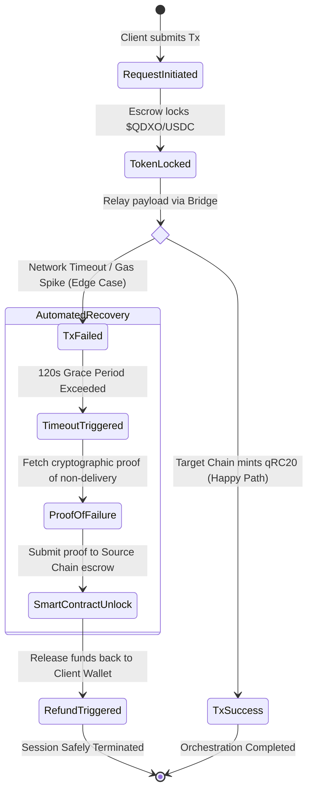

# QDXO Project: Orchestrator on Solana

```text
+------------------------+
|  Client (Lab/Pharma)   |
+------------------------+
        |
        v
+------------------------+
|  QDXO Orchestrator     |
|  (Solana Smart Logic)  |
+------------------------+
        |
        v
+------------------------+
|  GPU Nodes (A, B, C)   |
+------------------------+
### 📌 Explanation
The **QDX‑Orchestrator** receives an algorithm, splits it into three GPU nodes for parallel processing, consolidates the partial results, and applies a consensus filter that ensures integrity and fraud detection before releasing the final output.


## 📊 Flowchartp
Orchestrator Diagram
```text  

1. Descripción del proyecto  
2. Flowchart (diagrama ASCII)  
3. Step-by-Step Explanation  
4. **Execution Commands   
5. Notes (recomendaciones técnicas)


        +----------------------+
        |  Client (Lab/Pharma) |
        +----------+-----------+
                   |
                   v
        +----------------------+
        |  QDXO Orchestrator   |
        |  (Solana Smart Logic)|
        +----------+-----------+
                   |
                   v
        +----------------------+
        |  Blockchain Storage  |
        |  (Simulation Results)|
        +----------+-----------+
                   |
                   v
        +----------------------+
        |  Analytics Dashboard |
## 📄 Documentación General

# QDXO-Orchestrator
A unique orchestration system that allows all transactions to be sent through a single network, integrating multiple wallets and blockchains.

## Demo
To run the demo:

```bash
python qdx_demo.py

Demo video: Watch on YouTube🚀 The new Bitcoin of the future: QDXO
💬 Join the genesis community on Telegram → https://t.me/QDXOchannel (t.me in Bing) (bing.com in Bing)

InnovationQDXO-Orchestrator is the first architecture that enables universal interoperability between wallets and blockchains, reducing risks and simplifying integration.How it worksMultiple wallets → QDXO Node → Blockchains and DAppsEverything flows through a single orchestration network.Security and scalability guaranteed.

Next StepsIntegration with TestNetConnection with MetaMask/DeflyLaunch of the $QDXO token

## 🚀 Introduction
QDXO is an orchestration platform designed to integrate data and processes across blockchain and Web3 environments. Its goal is to enable interoperability and provide accessible tools for developers, researchers, and medical projects applying blockchain technology.

## ✨ Key Features
- Interoperability with multiple wallets (MetaMask, Exodus, Algorand).
- Lightweight execution on mobile environments using Termux.
- Support for scientific and medical blockchain projects.
- Preparation for the launch of the **$QDX** token.

## 🛠 Installation
Clone the repository and run in your environment:
```bash
git clone https://github.com/fistion567-core/QDXO-Orchestrator.git
cd QDXO-Orchestrator

no PC

pip install qdxo-orchestrator
On laptop
./qdxo-start

On Mobile (Android with Termux)
pkg install qdxo-orchestrator

 Make sure to connect your wallet (Defly, MetaMask, or PeraWallet) before starting QDXO to receive your airdrop tokens.

Example of initial execution:
python orchestrator.py --init

Token $QDXOInitial Supply: defined for testing and initial distribution.Utility: access to advanced functions within QDXO.Vision: empower medical and scientific projects through blockchain.

RoadmapFull integration with Algorand.Official launch of the $QDX token.Expansion of use cases in health and science.

ContactGitHub: fistion567-coreEmail: fistion567@gmail.com

       +----------------------+
## 📑 Step-by-Step Explanation

## 📄 Step-by-Step Explanation

1. **Algorithm Upload**  
   The orchestrator receives the algorithm file (e.g., `algorithm.sol`) and prepares it for execution.

2. **Orchestration Process**  
   The orchestrator coordinates execution across blockchain nodes, ensuring consistency and traceability.

3. **Simulation Results**  
   Results are stored on-chain and can be retrieved for analysis and verification.

---

## ⚙️ Execution Commands

```bash
# 1. Upload algorithm file
python3 qdx_demo.py --upload algorithm.sol

# 2. Run orchestration process
python3 qdx_demo.py --run orchestrator

# 3. Retrieve simulation results
python3 qdx_demo.py --fetch results.json

## ⚙️ Execution Commands

```bash
# 1. Upload algorithm file
python3 qdx_demo.py --upload algorithm.sol

# 2. Run orchestration process
python3 qdx_demo.py --run orchestrator

# 3. Retrieve simulation results
python3 qdx_demo.py --fetch results.json
1. **Algorithm Upload:** The client (laboratory or pharmaceutical company) uploads the molecular simulation algorithm to the system and deposits the payment in $QDXO tokens or USDC.
2. **Solana Orchestrator:** The smart contract receives the mathematical matrix and splits it into three parts.
    - Assigns tasks to different GPU nodes.
    - Uses blind verification to ensure nodes do not know the complete calculation.
3. **Chunk Distribution:** Each fragment is sent to an independent mining node (Node A, Node B, Node C), which executes the simulation on its GPU.
4. **Partial Results:** Each node returns its corresponding mathematical result (Result 1, Result 2, Result 3).
5. **Consensus Filter:** The system applies triple blind verification:
    - If all three results are identical, the task is validated.
    - If there are discrepancies, the fraudulent node is identified and *slashing* is applied.
6. **Results Release:**
    - The medical professional receives the final results of the simulation.
    - Miners receive their corresponding payment.
    - 5% of the fee is automatically burned as a deflationary mechanism.
7. **Fraud Management:** In case a fraudulent node is detected:
    - The penalty (*slashing*) is executed.
    - The task is reassigned to another node to guarantee integrity.

## 📖 QDXO Whitepaper Summary

The QDXO Project introduces a **decentralized exchange resistant to quantum attacks**, featuring key innovations:
- **Post-Quantum Security:** Use of CRYSTALS-Dilithium and Kyber algorithms, standardized by NIST.
- **QEVM & QR-PoS:** Proprietary virtual machine and optimized consensus, delivering over 5,000 TPS and sub-second finality.
- **Asset Shielding:** Conversion of classical assets (BTC, ETH, USDC) into secure versions (qBTC, qETH, qUSDC).
- **qRC20 Standard:** Tokens compatible with ERC-20 but reinforced with post-quantum cryptography.
- **Cross-chain Bridges:** Trustless infrastructure to move assets between chains using multiple validators.

## 🎯 Objective
This workflow ensures:
- Transparency in the execution of molecular simulations.
- Clear economic incentives for miners.
- Security through blind verification and triple consensus.
- Direct medical impact by accelerating pharmaceutical discoveries.
- Protection of digital assets against quantum threats.

## 🚀 Next Steps
- Implementation of the smart contract on Solana.
- Development of the interface for medical and pharmaceutical clients.
- Integration with the payment system in $QDXO and USDC.
- Expansion of cross-chain bridges and adoption of the qRC20 standard.
### 🛡️ Core Security & Compliance Standard

Given the sensitivity of handling infrastructure for pharmaceutical and medical entities, the orchestrator implements a **Zero-Knowledge Data Hygiene Architecture**:

* **PII Anonymization**: No Patient Health Information (PHI) or Personally Identifiable Information (PII) ever touches the blockchain layer. Data payloads are encrypted off-chain using AES-256.
* **On-Chain Cryptographic Proofs**: Only immutable cryptographic hashes of fulfillment milestones, verification timestamps, and compliance audits are permanently anchored to the distributed ledger.
* **Non-Custodial Escrow**: Payment streams in **\$QDXO** and **USDC** are governed strictly by decentralized smart contracts. The platform never holds or controls client private keys or funds.

### 🌐 Cross-Chain Interoperability & Fees

The platform utilizes a hybrid liquidity engine to ensure cheap, frictionless operations across ecosystems:

* **Gas Optimization Layer**: Intended for ultra-low fee handling, abstracting multi-chain complexity so medical enterprises only need to interact with a unified interface.
* **qRC20 Token Utility**: The **\$QDXO** token functions as the native network key, automatically covering cross-chain bridge relay costs, validation rewards, and priority orchestration queuing.
### 🔄 Advanced Fault Tolerance & Cross-Chain Atomicity

The most complex engineering challenge of the **QDXO-Orchestrator** is ensuring atomic transaction execution across multiple chains. If a bridge relay fails mid-transit, our automated state machine guarantees asset recovery without human intervention:



#### Technical Breakdown of the Recovery Mechanism:
* **Atomic State Locking**: Funds are held in a non-custodial source escrow. They are never lost in transit if the target chain experiences sudden congestion or a hard fork.
* **Cryptographic Proof of Failure**: Instead of relying on a centralized backend oracle, the orchestrator verifies target-chain state roots to mathematically prove a transaction did not execute.
* **Auto-Refund Vector**: Once non-delivery is cryptographically proven, the source contract safely unlocks and reverses the token escrow natively.

  ## 🌍 Impact and Purpose

QDXO is designed to bring **trust, transparency, and efficiency** to medical and pharmaceutical processes through blockchain orchestration.  

- **Healthcare Applications**: Enables secure storage and verification of clinical algorithms and simulation results.  
- **Financial Inclusion**: Provides a decentralized framework for tokenized access ($QDX), lowering barriers for institutions and individuals.  
- **Traceability**: Ensures end-to-end visibility of data, from algorithm upload to blockchain storage and analytics.  
- **Scalability**: Built on Solana, allowing high throughput and low transaction costs.  

By combining blockchain technology with medical innovation, QDXO aims to **improve patient outcomes, reduce fraud, and accelerate research adoption**.

## 🔐 Wallet Connection (Defly / Pera)

To interact with the blockchain, QDXO requires a connected wallet.  
Supported wallets: **Defly** and **Pera**.

```bash
# 1. Connect wallet
solana-keygen new --outfile ~/.config/solana/id.json

# 2. Import wallet into Defly/Pera
# (Use the generated seed phrase from Solana CLI)

# 3. Verify connection
solana address

### ⚖ Legal Disclaimer
This project is licensed under the MIT License.
Commercial use or integration requires connection with the $QDXO token and authorization from the author.
© 2026 Roni — All rights reserved.
README.md
---

### 🔗 Repository Link
Visit the project on GitHub

### 📬 Contact
If you want to collaborate, contribute ideas, or learn more about QDX-Orchestrator, write to me directly:
- 📧 Email: fistion567@gmail.com
    
---
**Official Ticker:** $QDXO  
*(Updated to avoid conflict with Quidax Token - QDX)*
