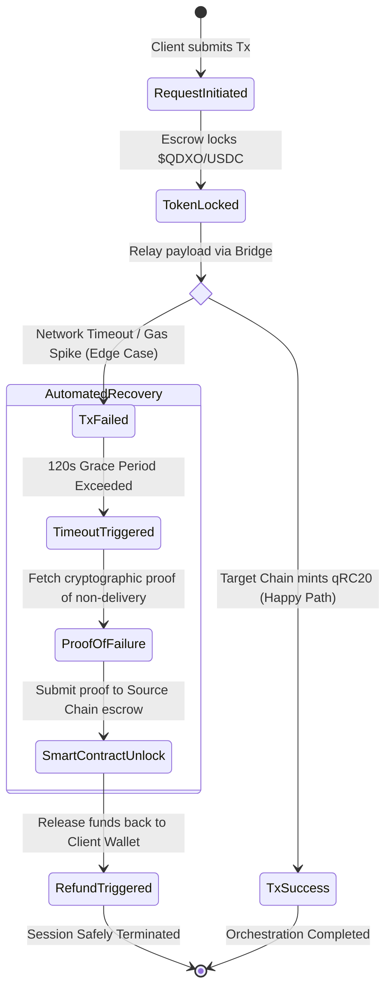

About QDXO

QDXO is a decentralized orchestrator designed to integrate blockchain governance, artificial intelligence, and tokenomics into scientific research. Our mission is to empower researchers and medical innovators by providing transparent funding mechanisms, interoperable smart contracts, and community-driven decision-making.

By combining Web3 infrastructure with DeSci principles, QDXO enables secure collaboration, fair resource allocation, and scalable innovation. This project aims to bridge the gap between science and decentralized technology, creating a sustainable ecosystem where knowledge and impact are rewarded.

# QDX‑Orchestrator

## 📖 Introducción / Introduction

### Español
QDX‑Orchestrator es un motor de cálculo distribuido diseñado para procesar datos médicos de forma segura en la blockchain de Solana.  
El objetivo es combinar velocidad y descentralización con cumplimiento legal y privacidad avanzada.

### English
QDX‑Orchestrator is a distributed computation engine designed to securely process medical data on Solana’s blockchain.  
The goal is to combine speed and decentralization with legal compliance and advanced privacy.

---

## 🏗️ Arquitectura Técnica / Technical Architecture

- **Procesamiento off‑chain seguro / Secure off‑chain processing**  
- **Publicación de pruebas criptográficas en Solana / Cryptographic proofs on Solana**  
- **Interfaz/API para usuarios y médicos / User & medical API interface**

---

## 🔐 Privacidad y Cumplimiento / Privacy & Compliance

### Español
El proyecto **no almacena historiales médicos en texto plano** en la blockchain pública de Solana.  
Para cumplir con HIPAA y GDPR usamos un enfoque híbrido:

- **Zero‑Knowledge Proofs** → Validamos cálculos médicos sin revelar datos.  
- **Criptografía post‑cuántica** → Seguridad a largo plazo frente a ataques futuros.  
- **Procesamiento off‑chain seguro** → Los historiales se procesan fuera de la blockchain.  
- **Tokenización de identidades** → Pacientes representados con identificadores criptográficos.  
- **Consentimiento granular** → Control total de los pacientes sobre sus datos.

**Resumen:** El QDX‑Orchestrator publica pruebas criptográficas, no historiales médicos.

---

### English
The project **does not store medical records in plain text** on Solana’s public blockchain.  
To comply with HIPAA and GDPR we use a hybrid approach:

- **Zero‑Knowledge Proofs** → Validate medical computations without revealing data.  
- **Post‑quantum cryptography** → Long‑term security against future quantum attacks.  
- **Secure off‑chain processing** → Records are processed off‑chain, only proofs are published.  
- **Identity tokenization** → Patients represented by cryptographic identifiers.  
- **Granular consent** → Patients control and revoke data usage permissions.

**Summary:** QDX‑Orchestrator publishes cryptographic proofs, not medical records.

---

[📋 Copiar este bloque](#)

---

## ⚙️ Instalación / Installation

```bash
git clone https://github.com/tuusuario/qdx-orchestrator.git
cd qdx-orchestrator
npm install
npm run dev

npm run demo

Licencia / LicenseMIT License


## 🔐 Privacidad y Cumplimiento / Privacy & Compliance

### Español
El proyecto **no almacena historiales médicos en texto plano** en la blockchain pública de Solana.  
Para cumplir con HIPAA y GDPR usamos un enfoque híbrido:

- **Zero‑Knowledge Proofs** → Validamos cálculos médicos sin revelar datos.  
- **Criptografía post‑cuántica** → Seguridad a largo plazo frente a ataques futuros.  
- **Procesamiento off‑chain seguro** → Los historiales se procesan fuera de la blockchain.  
- **Tokenización de identidades** → Pacientes representados con identificadores criptográficos.  
- **Consentimiento granular** → Control total de los pacientes sobre sus datos.

**Resumen:** El QDX‑Orchestrator publica pruebas criptográficas, no historiales médicos.

---

### English
The project **does not store medical records in plain text** on Solana’s public blockchain.  
To comply with HIPAA and GDPR we use a hybrid approach:

- **Zero‑Knowledge Proofs** → Validate medical computations without revealing data.  
- **Post‑quantum cryptography** → Long‑term security against future quantum attacks.  
- **Secure off‑chain processing** → Records are processed off‑chain, only proofs are published.  
- **Identity tokenization** → Patients represented by cryptographic identifiers.  
- **Granular consent** → Patients control and revoke data usage permissions.

**Summary:** QDXO‑Orchestrator publishes cryptographic proofs, not medical records.

---

[📋 Copiar este bloque](#)


## 🔐 Privacidad y Cumplimiento / Privacy & Compliance

El proyecto **no almacena historiales médicos en texto plano** en la blockchain pública de Solana.  
Para cumplir con HIPAA y GDPR usamos un enfoque híbrido:

- Zero‑Knowledge Proofs → Validamos cálculos médicos sin revelar datos.  
- Criptografía post‑cuántica → Seguridad a largo plazo frente a ataques futuros.  
- Procesamiento off‑chain seguro → Los historiales se procesan fuera de la blockchain.  
- Tokenización de identidades → Pacientes representados con identificadores criptográficos.  
- Consentimiento granular → Control total de los pacientes sobre sus datos.

**Resumen:** El QDXO‑Orchestrator publica pruebas criptográficas, no historiales médicos.

---

The project **does not store medical records in plain text** on Solana’s public blockchain.  
To comply with HIPAA and GDPR we use a hybrid approach:

- Zero‑Knowledge Proofs → Validate medical computations without revealing data.  
- Post‑quantum cryptography → Long‑term security against future quantum attacks.  
- Secure off‑chain processing → Records are processed off‑chain, only proofs are published.  
- Identity tokenization → Patients represented by cryptographic identifiers.  
- Granular consent → Patients control and revoke data usage permissions.

**Summary:** QDXO‑Orchestrator publishes cryptographic proofs, not medical records.

---

[📋 Copiar este bloque](#)

<h3>Quick Demo</h3>

<pre id="codeSnippet">
QDXO orchestrator is running successfully!
</pre>

<button onclick="copyText()">Copy to clipboard</button>

<script>
function copyText() {
  const text = document.getElementById("codeSnippet").innerText;
  navigator.clipboard.writeText(text).then(() => {
    alert("Copied to clipboard!");
  });
}
</script>

## Quick Demo

After installation, you can run the orchestrator.  
If everything is working correctly, you should see:

<pre id="codeSnippet">
QDXO orchestrator is running successfully!
</pre>
<button onclick="copyText()">Copy to clipboard</button>
<script>
function copyText() {
  const text = document.getElementById("codeSnippet").innerText;
  navigator.clipboard.writeText(text).then(() => {
    alert("Copied to clipboard!");
  });
}
</script>

<style>
  #copyButton {
    background-color: #4CAF50; /* verde elegante */
    color: white;
    border: none;
    padding: 8px 16px;
    font-size: 14px;
    cursor: pointer;
    border-radius: 4px;
    transition: background-color 0.3s ease;
  }

  #copyButton:hover {
    background-color: #45a049; /* tono más oscuro al pasar el mouse */
  }

  pre {
    background-color: #f4f4f4;
    padding: 10px;
    border-radius: 4px;
    font-family: monospace;
  }
</style>

<pre id="codeSnippet">
QDXO orchestrator is running successfully!
</pre>
<button id="copyButton" onclick="copyText()">Copy to clipboard</button>

<script>
  function copyText() {
    const text = document.getElementById("codeSnippet").innerText;
    navigator.clipboard.writeText(text).then(() => {
      alert("Copied to clipboard!");
    });
  }
</script>

## Quick Demo

After installation, you can run the orchestrator.  
If everything is working correctly, you should see the following output:

<style>
  #copyButton {
    background-color: #4CAF50; /* elegant green */
    color: white;
    border: none;
    padding: 8px 16px;
    font-size: 14px;
    cursor: pointer;
    border-radius: 4px;
    transition: background-color 0.3s ease;
  }

  #copyButton:hover {
    background-color: #45a049; /* darker shade on hover */
  }

  pre {
    background-color: #f4f4f4;
    padding: 10px;
    border-radius: 4px;
    font-family: monospace;
  }
</style>

<pre id="codeSnippet">
QDXO orchestrator is running successfully!
</pre>
<button id="copyButton" onclick="copyText()">Copy to clipboard</button>

<script>
  function copyText() {
    const text = document.getElementById("codeSnippet").innerText;
    navigator.clipboard.writeText(text).then(() => {
      alert("Copied to clipboard!");
    });
  }
</script>

## QDXO Architecture

The QDXO Orchestrator is built on a layered architecture that ensures scalability, transparency, and efficiency.  
It is composed of three main layers:

### 1. Blockchain Governance Layer
This layer manages decentralized decision-making and ensures that all orchestrations follow transparent and auditable rules.  
It provides trust, immutability, and accountability for every process.

### 2. Artificial Intelligence Layer
The AI layer powers smart orchestration by analyzing data, predicting outcomes, and optimizing workflows.  
It enables adaptive decision-making and continuous improvement of the orchestrator.

### 3. Data Layer
The data layer handles secure storage, retrieval, and processing of information.  
It ensures that the orchestrator can access reliable datasets while maintaining privacy and integrity.

# QDXO Architecture

QDXO is built as a decentralized orchestrator that integrates three main layers:

1. **Blockchain Governance Layer**  
   - Smart contracts manage voting, funding allocation, and project governance.  
   - Interoperability across multiple chains ensures scalability and resilience.  

2. **Artificial Intelligence Layer**  
   - AI modules analyze research proposals, optimize resource allocation, and provide predictive insights.  
   - Machine learning models ensure transparency and fairness in decision-making.  

3. **Tokenomics Layer**  
   - The $QDXO token powers incentives, staking, and governance participation.  
   - Token distribution ensures sustainability and community engagement.  

**System Flow:**  
Users submit proposals → AI evaluates → Governance votes → Smart contracts execute funding and rewards.

# QDXO Tokenomics

The $QDXO token is designed to sustain the ecosystem and incentivize participation.

**Total Supply:** 100,000,000 QDX  

**Distribution:**  
- 30% Community & Grants  
- 25% Research Incentives  
- 20% Development Team  
- 15% Liquidity & Partnerships  
- 10% Reserve Fund  

**Utility:**  
- Governance voting rights  
- Staking rewards for long-term holders  
- Incentives for researchers and contributors  
- Transaction fees within the QDXO ecosystem  

**Security Measures:**  
- Anti-inflation mechanisms through capped supply  
- Smart contract audits for transparency  
- Vesting schedules for team allocation

[Architecture](ARCHITECTURE.md)[Tokenomics](TOKENOMICS.md)

# QDXO Project: Orchestrator on Solana

```text
+------------------------+
|  Client (Lab/Pharma)   |
+------------------------+
        |
        v
+------------------------+
|  QDXO Orchestrator     |
|  (Solana Smart Logic)  |
+------------------------+
        |
        v
+------------------------+
|  GPU Nodes (A, B, C)   |
+------------------------+
### 📌 Explanation
The **QDX‑Orchestrator** receives an algorithm, splits it into three GPU nodes for parallel processing, consolidates the partial results, and applies a consensus filter that ensures integrity and fraud detection before releasing the final output.

# QDXO Orchestrator

QDXO is a blockchain-based project designed to combine sustainability, accessibility, and innovation. Unlike Bitcoin, which faces long-term challenges due to its fixed supply, QDXO adopts a **hybrid model** that ensures continuous rewards and long-term stability.

## 🔹 Key Features

- **Node Rewards**: Users running nodes receive $QDX0 as incentives for validating transactions, similar to Bitcoin miners.
- **Staking Model**: Participants who lock their tokens to secure the network earn periodic payments.
- **Liquidity in DEX**: Liquidity providers in pools can earn commissions, expanding the ways to obtain coins.
- **Hybrid Tokenomics**: Controlled issuance with sustainable rewards, avoiding inflation while ensuring long-term incentives.

## 🔹 Why Hybrid?

Bitcoin will eventually stop issuing new coins (around 2140), leaving miners dependent only on transaction fees. QDXO solves this by combining:
- Moderate scarcity (to protect value).
- Constant rewards (to keep validators motivated).
- Real-world utility (medical, scientific, and social applications).

## 🔹 Roadmap (First 5 Years)

- **Year 1–2**: Launch, high rewards for nodes and staking, community growth.
- **Year 3–4**: Gradual reduction of rewards, expansion into medical/scientific projects, liquidity pools.
- **Year 5**: Hybrid model fully established, stable growth, strong adoption.

## 🔹 Founder Benefits

As the founder, you benefit from:
- Credibility and reputation in blockchain innovation.
- A growing reserve of tokens that increase in value with adoption.
- Strategic flexibility to adjust rewards and issuance.
- A differentiated narrative: “QDXO, the blockchain that learned from Bitcoin’s weaknesses.”

---

## 📈 Example Projection (First 90 Days)

- Initial reserve: 10 million $QDX0  
- Initial price: $0.01 USD → $100,000 USD  
- After 90 days (price $0.05 USD): $500,000 USD  

This shows how QDXO can generate significant growth even in its early stages.

---

## 🔹 License

This project is open-source. Contributions are welcome.

# QDXO Whitepaper

## Abstract
QDXO is a blockchain-based project designed to address the long-term sustainability challenges of Bitcoin and similar cryptocurrencies. By adopting a **hybrid tokenomics model**, QDXO ensures continuous rewards, balanced scarcity, and real-world utility. This whitepaper outlines the architecture, economic model, roadmap, and potential applications of QDXO.

---

## Introduction
Bitcoin has proven the viability of decentralized digital currencies, but its fixed supply creates long-term issues. Once all coins are mined (around 2140), miners will rely solely on transaction fees, which may reduce incentives and weaken network security. QDXO introduces a hybrid model that combines scarcity with continuous rewards, ensuring both value preservation and validator motivation.

---

## Architecture Overview
```text
Clients (Labs/Pharma) ---> QDXO Orchestrator ---> GPU Nodes (A, B, C)

Clients: Laboratories, pharmaceutical companies, or scientific institutions submit computational tasks.QDXO Orchestrator: Smart contract layer that distributes tasks and manages rewards.GPU Nodes: Decentralized computing units that execute tasks and return results.This architecture enables QDXO to serve both financial and scientific purposes, bridging blockchain with medical and research applications.

TokenomicsInitial Supply: 10 million $QDX0.Issuance Model: Hybrid — controlled scarcity with continuous rewards.Distribution:40% Node rewards.30% Staking incentives.20% Liquidity pools (DEX).10% Founder and development reserve.Inflation Control: Gradual reduction of rewards over time, balanced by utility-driven demand.

Roadmap (First 5 Years)Year 1–2: Launch, high rewards for nodes and staking, community growth.Year 3–4: Gradual reduction of rewards, integration into medical/scientific projects, liquidity expansion.Year 5: Hybrid model fully established, stable growth, strong adoption.

Use CasesMedical Research: Secure and decentralized computation for pharmaceutical and clinical studies.Scientific Collaboration: Distributed GPU nodes for large-scale simulations and data analysis.Financial Utility: Staking, liquidity pools, and transaction validation.

Founder BenefitsCredibility and reputation in blockchain innovation.Growing reserve of tokens that increase in value with adoption.Strategic flexibility to adjust rewards and issuance.A differentiated narrative: “QDXO, the blockchain that learned from Bitcoin’s weaknesses.”

Projection ExampleInitial reserve: 10 million $QDX0.Initial price: $0.01 USD → $100,000 USD.After 90 days (price $0.05 USD): $500,000 USD.This demonstrates the potential for rapid growth during early adoption.

ConclusionQDXO represents a new generation of blockchain projects that combine financial sustainability with real-world utility. By learning from Bitcoin’s limitations and integrating scientific applications, QDXO positions itself as a credible, impactful, and future-proof ecosystem.

LicenseThis project is open-source. Contributions are welcome.

# QDXO-Orchestrator

QDXO is a blockchain-based project designed to combine sustainability, accessibility, and innovation. Unlike Bitcoin, which faces long-term challenges due to its fixed supply, QDXO adopts a **hybrid model** that ensures continuous rewards and long-term stability.

Explanation:Clients send requests or data.QDXO Orchestrator processes and distributes tasks.GPU Nodes execute computations and return results.


Key FeaturesNode Rewards: Users running nodes receive $QDX0 as incentives for validating transactions.Staking Model: Participants who lock their tokens to secure the network earn periodic payments.Liquidity in DEX: Liquidity providers in pools can earn commissions.Hybrid Tokenomics: Controlled issuance with sustainable rewards, avoiding inflation while ensuring long-term incentives.

Why Hybrid?Bitcoin will eventually stop issuing new coins (around 2140), leaving miners dependent only on transaction fees. QDXO solves this by combining:Moderate scarcity (to protect value).Constant rewards (to keep validators motivated).Real-world utility (medical, scientific, and social applications)

Roadmap (First 5 Years)Year 1–2: Launch, high rewards for nodes and staking, community growth.Year 3–4: Gradual reduction of rewards, expansion into medical/scientific projects, liquidity pools.Year 5: Hybrid model fully established, stable growth, strong adoption.

Founder BenefitsAs the founder, you benefit from:Credibility and reputation in blockchain innovation.A growing reserve of tokens that increase in value with adoption.Strategic flexibility to adjust rewards and issuance.A differentiated narrative: “QDXO, the blockchain that learned from Bitcoin’s weaknesses.”

Example Projection (First 90 Days)Initial reserve: 10 million $QDX0Initial price: $0.01 USD → $100,000 USDAfter 90 days (price $0.05 USD): $500,000 USDThis shows how QDXO can generate significant growth even in its early stages.

LicenseThis project is open-source. Contributions are welcome.

---

## 🔹 Architecture Overview

```text
Clients (Labs/Pharma) ---> QDXO Orchestrator ---> GPU Nodes (A, B, C)


## 📊 Flowchartp
Orchestrator Diagram
```text  

1. Descripción del proyecto  
2. Flowchart (diagrama ASCII)  
3. Step-by-Step Explanation  
4. **Execution Commands   
5. Notes (recomendaciones técnicas)


        +----------------------+
        |  Client (Lab/Pharma) |
        +----------+-----------+
                   |
                   v
        +----------------------+
        |  QDXO Orchestrator   |
        |  (Solana Smart Logic)|
        +----------+-----------+
                   |
                   v
        +----------------------+
        |  Blockchain Storage  |
        |  (Simulation Results)|
        +----------+-----------+
                   |
                   v
        +----------------------+
        |  Analytics Dashboard |
## 📄 Documentación General

# QDXO-Orchestrator
A unique orchestration system that allows all transactions to be sent through a single network, integrating multiple wallets and blockchains.

## Demo
To run the demo:

```bash
python qdx_demo.py

Demo video: Watch on YouTube🚀 The new Bitcoin of the future: QDXO
💬 Join the genesis community on Telegram → https://t.me/QDXOchannel (t.me in Bing) (bing.com in Bing)

InnovationQDXO-Orchestrator is the first architecture that enables universal interoperability between wallets and blockchains, reducing risks and simplifying integration.How it worksMultiple wallets → QDXO Node → Blockchains and DAppsEverything flows through a single orchestration network.Security and scalability guaranteed.

Next StepsIntegration with TestNetConnection with MetaMask/DeflyLaunch of the $QDXO token

## 🚀 Introduction
QDXO is an orchestration platform designed to integrate data and processes across blockchain and Web3 environments. Its goal is to enable interoperability and provide accessible tools for developers, researchers, and medical projects applying blockchain technology.

## ✨ Key Features
- Interoperability with multiple wallets (MetaMask, Exodus, Algorand).
- Lightweight execution on mobile environments using Termux.
- Support for scientific and medical blockchain projects.
- Preparation for the launch of the **$QDX** token.

## 🛠 Installation
Clone the repository and run in your environment:
```bash
git clone https://github.com/fistion567-core/QDXO-Orchestrator.git
cd QDXO-Orchestrator

no PC

pip install qdxo-orchestrator
On laptop
./qdxo-start

On Mobile (Android with Termux)
pkg install qdxo-orchestrator

 Make sure to connect your wallet (Defly, MetaMask, or PeraWallet) before starting QDXO to receive your airdrop tokens.

Example of initial execution:
python orchestrator.py --init

Token $QDXOInitial Supply: defined for testing and initial distribution.Utility: access to advanced functions within QDXO.Vision: empower medical and scientific projects through blockchain.

RoadmapFull integration with Algorand.Official launch of the $QDX token.Expansion of use cases in health and science.

ContactGitHub: fistion567-coreEmail: fistion567@gmail.com

       +----------------------+
## 📑 Step-by-Step Explanation

## 📄 Step-by-Step Explanation

1. **Algorithm Upload**  
   The orchestrator receives the algorithm file (e.g., `algorithm.sol`) and prepares it for execution.

2. **Orchestration Process**  
   The orchestrator coordinates execution across blockchain nodes, ensuring consistency and traceability.

3. **Simulation Results**  
   Results are stored on-chain and can be retrieved for analysis and verification.

---

## ⚙️ Execution Commands

```bash
# 1. Upload algorithm file
python3 qdx_demo.py --upload algorithm.sol

# 2. Run orchestration process
python3 qdx_demo.py --run orchestrator

# 3. Retrieve simulation results
python3 qdx_demo.py --fetch results.json

## ⚙️ Execution Commands

```bash
# 1. Upload algorithm file
python3 qdx_demo.py --upload algorithm.sol

# 2. Run orchestration process
python3 qdx_demo.py --run orchestrator

# 3. Retrieve simulation results
python3 qdx_demo.py --fetch results.json
1. **Algorithm Upload:** The client (laboratory or pharmaceutical company) uploads the molecular simulation algorithm to the system and deposits the payment in $QDXO tokens or USDC.
2. **Solana Orchestrator:** The smart contract receives the mathematical matrix and splits it into three parts.
    - Assigns tasks to different GPU nodes.
    - Uses blind verification to ensure nodes do not know the complete calculation.
3. **Chunk Distribution:** Each fragment is sent to an independent mining node (Node A, Node B, Node C), which executes the simulation on its GPU.
4. **Partial Results:** Each node returns its corresponding mathematical result (Result 1, Result 2, Result 3).
5. **Consensus Filter:** The system applies triple blind verification:
    - If all three results are identical, the task is validated.
    - If there are discrepancies, the fraudulent node is identified and *slashing* is applied.
6. **Results Release:**
    - The medical professional receives the final results of the simulation.
    - Miners receive their corresponding payment.
    - 5% of the fee is automatically burned as a deflationary mechanism.
7. **Fraud Management:** In case a fraudulent node is detected:
    - The penalty (*slashing*) is executed.
    - The task is reassigned to another node to guarantee integrity.

## 📖 QDXO Whitepaper Summary

The QDXO Project introduces a **decentralized exchange resistant to quantum attacks**, featuring key innovations:
- **Post-Quantum Security:** Use of CRYSTALS-Dilithium and Kyber algorithms, standardized by NIST.
- **QEVM & QR-PoS:** Proprietary virtual machine and optimized consensus, delivering over 5,000 TPS and sub-second finality.
- **Asset Shielding:** Conversion of classical assets (BTC, ETH, USDC) into secure versions (qBTC, qETH, qUSDC).
- **qRC20 Standard:** Tokens compatible with ERC-20 but reinforced with post-quantum cryptography.
- **Cross-chain Bridges:** Trustless infrastructure to move assets between chains using multiple validators.

## 🎯 Objective
This workflow ensures:
- Transparency in the execution of molecular simulations.
- Clear economic incentives for miners.
- Security through blind verification and triple consensus.
- Direct medical impact by accelerating pharmaceutical discoveries.
- Protection of digital assets against quantum threats.

## 🚀 Next Steps
- Implementation of the smart contract on Solana.
- Development of the interface for medical and pharmaceutical clients.
- Integration with the payment system in $QDXO and USDC.
- Expansion of cross-chain bridges and adoption of the qRC20 standard.
### 🛡️ Core Security & Compliance Standard

Given the sensitivity of handling infrastructure for pharmaceutical and medical entities, the orchestrator implements a **Zero-Knowledge Data Hygiene Architecture**:

* **PII Anonymization**: No Patient Health Information (PHI) or Personally Identifiable Information (PII) ever touches the blockchain layer. Data payloads are encrypted off-chain using AES-256.
* **On-Chain Cryptographic Proofs**: Only immutable cryptographic hashes of fulfillment milestones, verification timestamps, and compliance audits are permanently anchored to the distributed ledger.
* **Non-Custodial Escrow**: Payment streams in **\$QDXO** and **USDC** are governed strictly by decentralized smart contracts. The platform never holds or controls client private keys or funds.

### 🌐 Cross-Chain Interoperability & Fees

The platform utilizes a hybrid liquidity engine to ensure cheap, frictionless operations across ecosystems:

* **Gas Optimization Layer**: Intended for ultra-low fee handling, abstracting multi-chain complexity so medical enterprises only need to interact with a unified interface.
* **qRC20 Token Utility**: The **\$QDXO** token functions as the native network key, automatically covering cross-chain bridge relay costs, validation rewards, and priority orchestration queuing.
### 🔄 Advanced Fault Tolerance & Cross-Chain Atomicity

The most complex engineering challenge of the **QDXO-Orchestrator** is ensuring atomic transaction execution across multiple chains. If a bridge relay fails mid-transit, our automated state machine guarantees asset recovery without human intervention:



#### Technical Breakdown of the Recovery Mechanism:
* **Atomic State Locking**: Funds are held in a non-custodial source escrow. They are never lost in transit if the target chain experiences sudden congestion or a hard fork.
* **Cryptographic Proof of Failure**: Instead of relying on a centralized backend oracle, the orchestrator verifies target-chain state roots to mathematically prove a transaction did not execute.
* **Auto-Refund Vector**: Once non-delivery is cryptographically proven, the source contract safely unlocks and reverses the token escrow natively.

  ## 🌍 Impact and Purpose

QDXO is designed to bring **trust, transparency, and efficiency** to medical and pharmaceutical processes through blockchain orchestration.  

- **Healthcare Applications**: Enables secure storage and verification of clinical algorithms and simulation results.  
- **Financial Inclusion**: Provides a decentralized framework for tokenized access ($QDX), lowering barriers for institutions and individuals.  
- **Traceability**: Ensures end-to-end visibility of data, from algorithm upload to blockchain storage and analytics.  
- **Scalability**: Built on Solana, allowing high throughput and low transaction costs.  

By combining blockchain technology with medical innovation, QDXO aims to **improve patient outcomes, reduce fraud, and accelerate research adoption**.

## 🔐 Wallet Connection (Defly / Pera)

To interact with the blockchain, QDXO requires a connected wallet.  
Supported wallets: **Defly** and **Pera**.

```bash
# 1. Connect wallet
solana-keygen new --outfile ~/.config/solana/id.json

# 2. Import wallet into Defly/Pera
# (Use the generated seed phrase from Solana CLI)

# 3. Verify connection
solana address

### ⚖ Legal Disclaimer
This project is licensed under the MIT License.
Commercial use or integration requires connection with the $QDXO token and authorization from the author.
© 2026 Roni — All rights reserved.
README.md
---

### 🔗 Repository Link
Visit the project on GitHub

### 📬 Contact
If you want to collaborate, contribute ideas, or learn more about QDX-Orchestrator, write to me directly:
- 📧 Email: fistion567@gmail.com
    
---
**Official Ticker:** $QDXO  
*(Updated to avoid conflict with Quidax Token - QDX)*
